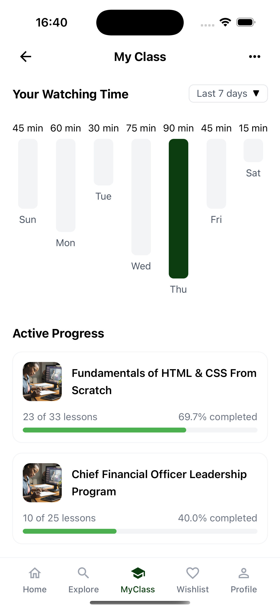

# EduLearn Mobile App

A modern e-learning mobile application built with React Native and Tailwind CSS, designed to provide an intuitive learning experience for users seeking to enhance their skills across various domains.

## Technical Stack

- React Native
- Tailwind CSS (via NativeWind)
- Expo
- React Navigation
- TypeScript

## Features

- 📱 Clean and modern UI design
- 🎨 Tailwind CSS styling
- 🌙 Dark mode support
- 📚 Course categorization
- 🔍 Search functionality
- 👤 User profile management
- 📲 Course details with rich media

## Screenshots

<table>
    <tr>
        <td></td>
        <td></td>
        <td></td>
    </tr>
    <tr>
        <td></td>
        <td></td>
        <td></td>
    </tr>
</table>
